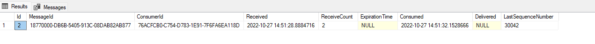
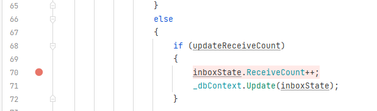
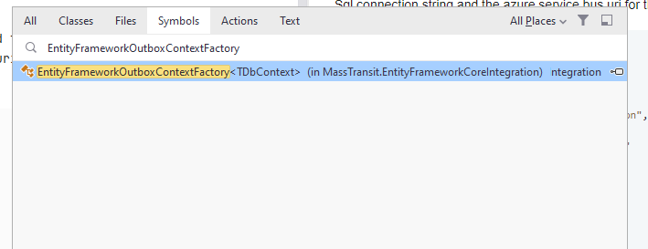

# masstransit-inbox-example

Main setup.

This is a project that uses Masstransit 8.0.7 and is configured to use Azure service bus as a broker.
The project is also setup to use the [transactional outbox](https://masstransit-project.com/advanced/transactional-outbox.html#transactional-outbox) feature with sql server as persistence.

This project simulates an issue that I encountered.

The issue is that messages get published multiple times in the context of consuming a command that produces a large
number of messages that take some time to send. 

Double sending happens if the sending of these messages takes longer than the MaxAutoRenewDuration time that is set for that consumer.

To make this behaviour happen fast the consumer has been configured with a MaxAutoRenewDuration = 20 seconds

```c#
protected override void ConfigureConsumer(IReceiveEndpointConfigurator endpointConfigurator, IConsumerConfigurator<CreateOrdersCommandConsumer> consumerConfigurator)
    {
        endpointConfigurator.UseEntityFrameworkOutbox<WorkerDbContext>(_serviceProvider);
        if (endpointConfigurator is IServiceBusReceiveEndpointConfigurator cfg)
        {
            cfg.MaxAutoRenewDuration = TimeSpan.FromSeconds(20);
            cfg.LockDuration = TimeSpan.FromSeconds(2);
        }
    }
```


To run this example you need to update the appsetting.json in the worker and the publisher.
For the worker fill in the Sql connection string and the azure service bus uri for the publisher only the azure service bus uri is needed

```json
{
  "Logging": {
    "LogLevel": {
      "Default": "Debug",
      "Microsoft.Hosting.Lifetime": "Information",
      "Microsoft": "Information",
      "Microsoft.EntityFrameworkCore":"Warning"      
    }
  },  
  "ConnectionStrings": {
    "Sql":"",
    "AzureServiceBus":"sb://NAME-HERE"
  }
}
```

Then start the worker and publisher and hit enter on the publisher.
This wil send the CreateOrdersCommand the consumer wil create 30.000 OrderCreatedEvent and return.

The behaviour starts when the InboxState.ReceiveCount goes from 1 => 2


You can debug when this happens by putting a breakpoint in the [EntityFrameworkOutboxContextFactory](https://github.com/MassTransit/MassTransit/blob/3b6a9114bc4e776eb1c0e95210dd3d49064f2958/src/Persistence/MassTransit.EntityFrameworkCoreIntegration/EntityFrameworkCoreIntegration/EntityFrameworkOutboxContextFactory.cs#L70)


Using rider you can do this by searching Shift+Ctrl+T ans selecting Symbols


Example log:

```log
info: MassTransit[0]
      Configured endpoint CreateOrdersCommand, Consumer: WorkerService.Consumers.CreateOrdersCommandConsumer
dbug: MassTransit.Transports.BusDepot[0]
      Starting bus instances: IBus
dbug: MassTransit[0]
      Starting bus: sb://sb-name.servicebus.windows.net/
info: Microsoft.Hosting.Lifetime[0]
      Application started. Press Ctrl+C to shut down.
info: Microsoft.Hosting.Lifetime[0]
      Hosting environment: Development
info: Microsoft.Hosting.Lifetime[0]
      Content root path: S:\github\masstransit-inbox-example\inbox\WorkerService
dbug: MassTransit[0]
      Endpoint Ready: sb://sb-name.servicebus.windows.net/COMPUTER_WorkerService_bus_soayyyg5ppkymrfpbdpmokw9r8?autodelete=300
dbug: MassTransit[0]
      Topic: Messages/CreateOrdersCommand ()
dbug: MassTransit[0]
      Queue: CreateOrdersCommand (dead letter)
dbug: MassTransit[0]
      Updating subscription: CreateOrdersCommand (Messages/CreateOrdersCommand -> http://sb-name.servicebus.windows.net/CreateOrdersCommand)
dbug: MassTransit[0]
      Subscription CreateOrdersCommand (Messages/CreateOrdersCommand -> http://sb-name.servicebus.windows.net/CreateOrdersCommand)
dbug: MassTransit[0]
      Endpoint Ready: sb://sb-name.servicebus.windows.net/CreateOrdersCommand
info: MassTransit[0]
      Bus started: sb://sb-name.servicebus.windows.net/
dbug: MassTransit[0]
      Create send transport: sb://sb-name.servicebus.windows.net/Messages/OrderCreatedEvent?type=topic
dbug: MassTransit.Messages[0]
      RECEIVE sb://sb-name.servicebus.windows.net/CreateOrdersCommand 18770000-db6b-5405-913c-08dab82ab877 Messages.CreateOrdersCommand WorkerService.Consumers.CreateOrdersCommandConsumer(00:00:03.0944914)
dbug: MassTransit[0]
      Outbox Consumed: 18770000-db6b-5405-913c-08dab82ab877 10/27/2022 14:51:32
dbug: MassTransit[0]
      Create send transport: sb://sb-name.servicebus.windows.net/Messages/OrderCreatedEvent?type=topic
dbug: MassTransit[0]
      Topic: Messages/OrderCreatedEvent ()
dbug: MassTransit.Messages[0]
      SEND sb://sb-name.servicebus.windows.net/Messages/OrderCreatedEvent?type=topic b4300000-db6b-5405-4eb8-08dab82abaef MassTransit.Middleware.OutboxMessagePipe<>+Outbox<Messages.CreateOrdersCommand>
dbug: MassTransit[0]
      Outbox Sent: 18770000-db6b-5405-913c-08dab82ab877 30001 b4300000-db6b-5405-4eb8-08dab82abaef
dbug: MassTransit.Messages[0]
      SEND sb://sb-name.servicebus.windows.net/Messages/OrderCreatedEvent?type=topic b4300000-db6b-5405-931f-08dab82abaf8 MassTransit.Middleware.OutboxMessagePipe<>+Outbox<Messages.CreateOrdersCommand>
dbug: MassTransit[0]
      Outbox Sent: 18770000-db6b-5405-913c-08dab82ab877 30002 b4300000-db6b-5405-931f-08dab82abaf8
dbug: MassTransit.Messages[0]
      SEND sb://sb-name.servicebus.windows.net/Messages/OrderCreatedEvent?type=topic b4300000-db6b-5405-b34b-08dab82abaf8 MassTransit.Middleware.OutboxMessagePipe<>+Outbox<Messages.CreateOrdersCommand>
dbug: MassTransit[0]
      Outbox Sent: 18770000-db6b-5405-913c-08dab82ab877 30003 b4300000-db6b-5405-b34b-08dab82abaf8
dbug: MassTransit.Messages[0]
      SEND sb://sb-name.servicebus.windows.net/Messages/OrderCreatedEvent?type=topic b4300000-db6b-5405-b8c9-08dab82abaf8 MassTransit.Middleware.OutboxMessagePipe<>+Outbox<Messages.CreateOrdersCommand>
dbug: MassTransit[0]
      Outbox Sent: 18770000-db6b-5405-913c-08dab82ab877 30004 b4300000-db6b-5405-b8c9-08dab82abaf8
dbug: MassTransit.Messages[0]
      SEND sb://sb-name.servicebus.windows.net/Messages/OrderCreatedEvent?type=topic b4300000-db6b-5405-ca68-08dab82abaf8 MassTransit.Middleware.OutboxMessagePipe<>+Outbox<Messages.CreateOrdersCommand>
dbug: MassTransit[0]
      Outbox Sent: 18770000-db6b-5405-913c-08dab82ab877 30005 b4300000-db6b-5405-ca68-08dab82abaf8
dbug: MassTransit.Messages[0]
      SEND sb://sb-name.servicebus.windows.net/Messages/OrderCreatedEvent?type=topic b4300000-db6b-5405-cef0-08dab82abaf8 MassTransit.Middleware.OutboxMessagePipe<>+Outbox<Messages.CreateOrdersCommand>
dbug: MassTransit[0]
      Outbox Sent: 18770000-db6b-5405-913c-08dab82ab877 30006 b4300000-db6b-5405-cef0-08dab82abaf8
dbug: MassTransit.Messages[0]
      SEND sb://sb-name.servicebus.windows.net/Messages/OrderCreatedEvent?type=topic b4300000-db6b-5405-d292-08dab82abaf8 MassTransit.Middleware.OutboxMessagePipe<>+Outbox<Messages.CreateOrdersCommand>
dbug: MassTransit[0]
      Outbox Sent: 18770000-db6b-5405-913c-08dab82ab877 30007 b4300000-db6b-5405-d292-08dab82abaf8
dbug: MassTransit.Messages[0]
      SEND sb://sb-name.servicebus.windows.net/Messages/OrderCreatedEvent?type=topic b4300000-db6b-5405-d60f-08dab82abaf8 MassTransit.Middleware.OutboxMessagePipe<>+Outbox<Messages.CreateOrdersCommand>
dbug: MassTransit[0]
      Outbox Sent: 18770000-db6b-5405-913c-08dab82ab877 30008 b4300000-db6b-5405-d60f-08dab82abaf8
dbug: MassTransit.Messages[0]
      SEND sb://sb-name.servicebus.windows.net/Messages/OrderCreatedEvent?type=topic b4300000-db6b-5405-da2b-08dab82abaf8 MassTransit.Middleware.OutboxMessagePipe<>+Outbox<Messages.CreateOrdersCommand>
dbug: MassTransit[0]
      Outbox Sent: 18770000-db6b-5405-913c-08dab82ab877 30009 b4300000-db6b-5405-da2b-08dab82abaf8
dbug: MassTransit.Messages[0]
      SEND sb://sb-name.servicebus.windows.net/Messages/OrderCreatedEvent?type=topic b4300000-db6b-5405-ddac-08dab82abaf8 MassTransit.Middleware.OutboxMessagePipe<>+Outbox<Messages.CreateOrdersCommand>
dbug: MassTransit[0]
      Outbox Sent: 18770000-db6b-5405-913c-08dab82ab877 30010 b4300000-db6b-5405-ddac-08dab82abaf8
dbug: MassTransit.Messages[0]
      SEND sb://sb-name.servicebus.windows.net/Messages/OrderCreatedEvent?type=topic b4300000-db6b-5405-e112-08dab82abaf8 MassTransit.Middleware.OutboxMessagePipe<>+Outbox<Messages.CreateOrdersCommand>
dbug: MassTransit[0]
      Outbox Sent: 18770000-db6b-5405-913c-08dab82ab877 30011 b4300000-db6b-5405-e112-08dab82abaf8
dbug: MassTransit.Messages[0]
      SEND sb://sb-name.servicebus.windows.net/Messages/OrderCreatedEvent?type=topic b4300000-db6b-5405-e4d5-08dab82abaf8 MassTransit.Middleware.OutboxMessagePipe<>+Outbox<Messages.CreateOrdersCommand>
dbug: MassTransit[0]
      Outbox Sent: 18770000-db6b-5405-913c-08dab82ab877 30012 b4300000-db6b-5405-e4d5-08dab82abaf8
dbug: MassTransit.Messages[0]
      SEND sb://sb-name.servicebus.windows.net/Messages/OrderCreatedEvent?type=topic b4300000-db6b-5405-e839-08dab82abaf8 MassTransit.Middleware.OutboxMessagePipe<>+Outbox<Messages.CreateOrdersCommand>
dbug: MassTransit[0]
      Outbox Sent: 18770000-db6b-5405-913c-08dab82ab877 30013 b4300000-db6b-5405-e839-08dab82abaf8
dbug: MassTransit.Messages[0]
      SEND sb://sb-name.servicebus.windows.net/Messages/OrderCreatedEvent?type=topic b4300000-db6b-5405-ec20-08dab82abaf8 MassTransit.Middleware.OutboxMessagePipe<>+Outbox<Messages.CreateOrdersCommand>
dbug: MassTransit[0]
      Outbox Sent: 18770000-db6b-5405-913c-08dab82ab877 30014 b4300000-db6b-5405-ec20-08dab82abaf8
dbug: MassTransit.Messages[0]
      SEND sb://sb-name.servicebus.windows.net/Messages/OrderCreatedEvent?type=topic b4300000-db6b-5405-f032-08dab82abaf8 MassTransit.Middleware.OutboxMessagePipe<>+Outbox<Messages.CreateOrdersCommand>
dbug: MassTransit[0]
      Outbox Sent: 18770000-db6b-5405-913c-08dab82ab877 30015 b4300000-db6b-5405-f032-08dab82abaf8
dbug: MassTransit.Messages[0]
      SEND sb://sb-name.servicebus.windows.net/Messages/OrderCreatedEvent?type=topic b4300000-db6b-5405-f4e4-08dab82abaf8 MassTransit.Middleware.OutboxMessagePipe<>+Outbox<Messages.CreateOrdersCommand>
dbug: MassTransit[0]
      Outbox Sent: 18770000-db6b-5405-913c-08dab82ab877 30016 b4300000-db6b-5405-f4e4-08dab82abaf8
dbug: MassTransit.Messages[0]
      SEND sb://sb-name.servicebus.windows.net/Messages/OrderCreatedEvent?type=topic b4300000-db6b-5405-f4e4-08dab82abaf8 MassTransit.Middleware.OutboxMessagePipe<>+Outbox<Messages.CreateOrdersCommand>
dbug: MassTransit[0]
      Outbox Sent: 18770000-db6b-5405-913c-08dab82ab877 30016 b4300000-db6b-5405-f4e4-08dab82abaf8
dbug: MassTransit.Messages[0]
      SEND sb://sb-name.servicebus.windows.net/Messages/OrderCreatedEvent?type=topic b4300000-db6b-5405-f871-08dab82abaf8 MassTransit.Middleware.OutboxMessagePipe<>+Outbox<Messages.CreateOrdersCommand>
dbug: MassTransit[0]
      Outbox Sent: 18770000-db6b-5405-913c-08dab82ab877 30017 b4300000-db6b-5405-f871-08dab82abaf8
dbug: MassTransit.Messages[0]
      SEND sb://sb-name.servicebus.windows.net/Messages/OrderCreatedEvent?type=topic b4300000-db6b-5405-f871-08dab82abaf8 MassTransit.Middleware.OutboxMessagePipe<>+Outbox<Messages.CreateOrdersCommand>
dbug: MassTransit[0]
      Outbox Sent: 18770000-db6b-5405-913c-08dab82ab877 30017 b4300000-db6b-5405-f871-08dab82abaf8
dbug: MassTransit.Messages[0]
      SEND sb://sb-name.servicebus.windows.net/Messages/OrderCreatedEvent?type=topic b4300000-db6b-5405-fc49-08dab82abaf8 MassTransit.Middleware.OutboxMessagePipe<>+Outbox<Messages.CreateOrdersCommand>
dbug: MassTransit[0]
      Outbox Sent: 18770000-db6b-5405-913c-08dab82ab877 30018 b4300000-db6b-5405-fc49-08dab82abaf8
dbug: MassTransit.Messages[0]
      SEND sb://sb-name.servicebus.windows.net/Messages/OrderCreatedEvent?type=topic b4300000-db6b-5405-fc49-08dab82abaf8 MassTransit.Middleware.OutboxMessagePipe<>+Outbox<Messages.CreateOrdersCommand>
dbug: MassTransit[0]
      Outbox Sent: 18770000-db6b-5405-913c-08dab82ab877 30018 b4300000-db6b-5405-fc49-08dab82abaf8
dbug: MassTransit.Messages[0]
      SEND sb://sb-name.servicebus.windows.net/Messages/OrderCreatedEvent?type=topic b4300000-db6b-5405-ffde-08dab82abaf8 MassTransit.Middleware.OutboxMessagePipe<>+Outbox<Messages.CreateOrdersCommand>
dbug: MassTransit[0]
      Outbox Sent: 18770000-db6b-5405-913c-08dab82ab877 30019 b4300000-db6b-5405-ffde-08dab82abaf8
dbug: MassTransit.Messages[0]
      SEND sb://sb-name.servicebus.windows.net/Messages/OrderCreatedEvent?type=topic b4300000-db6b-5405-ffde-08dab82abaf8 MassTransit.Middleware.OutboxMessagePipe<>+Outbox<Messages.CreateOrdersCommand>
dbug: MassTransit[0]
      Outbox Sent: 18770000-db6b-5405-913c-08dab82ab877 30019 b4300000-db6b-5405-ffde-08dab82abaf8
dbug: MassTransit.Messages[0]
      SEND sb://sb-name.servicebus.windows.net/Messages/OrderCreatedEvent?type=topic b4300000-db6b-5405-035e-08dab82abaf9 MassTransit.Middleware.OutboxMessagePipe<>+Outbox<Messages.CreateOrdersCommand>
dbug: MassTransit[0]
      Outbox Sent: 18770000-db6b-5405-913c-08dab82ab877 30020 b4300000-db6b-5405-035e-08dab82abaf9
dbug: MassTransit.Messages[0]
      SEND sb://sb-name.servicebus.windows.net/Messages/OrderCreatedEvent?type=topic b4300000-db6b-5405-035e-08dab82abaf9 MassTransit.Middleware.OutboxMessagePipe<>+Outbox<Messages.CreateOrdersCommand>
dbug: MassTransit[0]
      Outbox Sent: 18770000-db6b-5405-913c-08dab82ab877 30020 b4300000-db6b-5405-035e-08dab82abaf9
dbug: MassTransit.Messages[0]
      SEND sb://sb-name.servicebus.windows.net/Messages/OrderCreatedEvent?type=topic b4300000-db6b-5405-072c-08dab82abaf9 MassTransit.Middleware.OutboxMessagePipe<>+Outbox<Messages.CreateOrdersCommand>
dbug: MassTransit[0]
      Outbox Sent: 18770000-db6b-5405-913c-08dab82ab877 30021 b4300000-db6b-5405-072c-08dab82abaf9
dbug: MassTransit.Messages[0]
      SEND sb://sb-name.servicebus.windows.net/Messages/OrderCreatedEvent?type=topic b4300000-db6b-5405-072c-08dab82abaf9 MassTransit.Middleware.OutboxMessagePipe<>+Outbox<Messages.CreateOrdersCommand>
dbug: MassTransit[0]
      Outbox Sent: 18770000-db6b-5405-913c-08dab82ab877 30021 b4300000-db6b-5405-072c-08dab82abaf9
dbug: MassTransit.Messages[0]
      SEND sb://sb-name.servicebus.windows.net/Messages/OrderCreatedEvent?type=topic b4300000-db6b-5405-0abe-08dab82abaf9 MassTransit.Middleware.OutboxMessagePipe<>+Outbox<Messages.CreateOrdersCommand>
dbug: MassTransit[0]
      Outbox Sent: 18770000-db6b-5405-913c-08dab82ab877 30022 b4300000-db6b-5405-0abe-08dab82abaf9
dbug: MassTransit.Messages[0]
      SEND sb://sb-name.servicebus.windows.net/Messages/OrderCreatedEvent?type=topic b4300000-db6b-5405-0abe-08dab82abaf9 MassTransit.Middleware.OutboxMessagePipe<>+Outbox<Messages.CreateOrdersCommand>
dbug: MassTransit[0]
      Outbox Sent: 18770000-db6b-5405-913c-08dab82ab877 30022 b4300000-db6b-5405-0abe-08dab82abaf9
dbug: MassTransit.Messages[0]
      SEND sb://sb-name.servicebus.windows.net/Messages/OrderCreatedEvent?type=topic b4300000-db6b-5405-0e3d-08dab82abaf9 MassTransit.Middleware.OutboxMessagePipe<>+Outbox<Messages.CreateOrdersCommand>
dbug: MassTransit[0]
      Outbox Sent: 18770000-db6b-5405-913c-08dab82ab877 30023 b4300000-db6b-5405-0e3d-08dab82abaf9
dbug: MassTransit.Messages[0]
      SEND sb://sb-name.servicebus.windows.net/Messages/OrderCreatedEvent?type=topic b4300000-db6b-5405-0e3d-08dab82abaf9 MassTransit.Middleware.OutboxMessagePipe<>+Outbox<Messages.CreateOrdersCommand>
dbug: MassTransit[0]
      Outbox Sent: 18770000-db6b-5405-913c-08dab82ab877 30023 b4300000-db6b-5405-0e3d-08dab82abaf9
dbug: MassTransit.Messages[0]
      SEND sb://sb-name.servicebus.windows.net/Messages/OrderCreatedEvent?type=topic b4300000-db6b-5405-11fc-08dab82abaf9 MassTransit.Middleware.OutboxMessagePipe<>+Outbox<Messages.CreateOrdersCommand>


```


